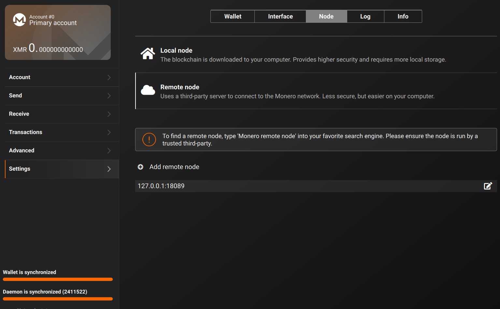

# monero-docker-compose
Run a FULL Monero Node on your Home Computer (Or Server... Or Home Server 😉 ) using Docker Compose

First of all, this is 100% based off of both SethForPrivacy's guide, his Docker Compose file, and his Monero Docker image. The main differences are that this Docker Compose file runs a full node (not pruned) using the Monero GUI's default Monero blockchain directory (~/.bitmonero) rather than the default Docker volume.  Additionally, Seth CREATED AND MAINTAINS the Monero docker image that this code pulls from DockerHub.  I highly recommend reading Seth's [EXCELLENT MONERO NODE ON DOCKER GUIDE](https://sethforprivacy.com/guides/run-a-monero-node/).  Also, GO THANK SETH FOR HIS AMAZING WORK.

With that.  

This Docker Compose script is meant to be run from a regular Linux (possibly Mac or Windows Subsystem for Linux) computer that has Docker installed and uses the default Monero blockchain save location that the Monero GUI wallet uses: ~/.bitmonero.  

If you already have data in this location, Docker will simply use what you have to start up the node, and pick up where your previous node or Monero GUI wallet left off.  If you don't have ANY data in this location, Docker will do everything for you.

This Docker Compose file includes [Watchtower](https://github.com/containrrr/watchtower), which will automagically update your Monero node as soon as an update is available.

# Table of Contents

I - [monero-docker-compose](#monero-docker-compose)
- [monero-docker-compose](#monero-docker-compose)
- [Table of Contents](#table-of-contents)
- [Who is this meant for?](#who-is-this-meant-for)
- [Requirements](#requirements)
- [Learning Docker](#learning-docker)
- [Run Commands](#run-commands)
- [Seed the Network!](#seed-the-network)
- [Donate](#donate)
- [References](#references)

# Who is this meant for?

- This is meant for someone who wants to run their Monero node using Docker, who may or may not have a full, pruned or partially downloaded node already through the use of the Monero GUI wallet or other node software.  

- It's a great way to start learning how Docker works- Docker is a super easy way to use a massive number of [Self-Hosted services out there.](https://github.com/awesome-selfhosted/awesome-selfhosted)

- Additionally, this is for someone who wants to ensure their node is always running in the background, whereas it may be difficult to know if the node is continually running when using the GUI. Docker will typically automatically start where it left off after rebooting your machine.

- Someone who just likes the ease of use of Docker Compose

# Requirements

- STOP any running Monero full nodes, including the node run by the GUI.  Rather than running a full node FROM the GUI, you'll point the GUI at your new 'remote' node running at ip: 127.0.0.1 port: 18089 as shown in photo below.

 

- You'll need space to run a full Monero node.  (140 GB)
- You MUST run Docker Compose as a regular user- not root.  

# Learning Docker

If you want to learn Docker and Docker Compose (If you can do Linux command line basics, you can do this tutorial), check out [This Tutorial](https://youtu.be/3c-iBn73dDE)

# Run Commands

- The below commands *must* be run from the same location as your docker-compose.yml file. If you're not in the same folder, they will not work.  

|  Action  | Command  |
|---|---|
| Start Node | docker-compose up --detach |
| Start a Node and see what the hell it's doing (press CTRL+C to stop the node) | docker-compose up |
| View a running Node's logs (can be run from anywhere) | docker logs --follow monerod |
| Stop Node  | docker-compose down |
| Update a Running Node | Not Necessary!  Watchtower will keep things updated |

# Seed the Network!

If you want to contribute to the Monero network by seeding the Monero blockchain, you will need to go into your router admin settings, open up port 18080 and point it at the ip of whatever computer/laptop/server is running the Monero node.  

# Donate

- If you enjoy this software, please feel free to send $XMR tips to [CryptoGrampy](https://twitter.com/CryptoGrampy)!

- $XMR : 85HmFCiEvjg7eysKExQyqh5WgAbExUw6gF8osaE2pFrvUhQdf1HdD6XSTgAr4ECYMre6HjWutPJSdJftQcYEz3m2PYYTE6Y
  

# References

[Seth's Docker Guide](https://sethforprivacy.com/guides/run-a-monero-node/)

[Seth's Beautiful Docker Compose File](https://github.com/sethsimmons/self-hosted-services/blob/main/docker-compose.yml)

[Monerod Command Reference Guide](https://monerodocs.org/interacting/monerod-reference/)
